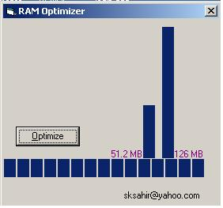

<div align="center">

## updated RamOptimizer And Indicator


</div>

### Description

updated version

This application uses follwing api to optimize availablity of Physical RAM

1. Private Declare Function GlobalAlloc Lib "kernel32" (ByVal wFlags As Long, ByVal dwBytes As Long) As Long

2. Private Declare Function GlobalFree Lib "kernel32" (ByVal hMem As Long) As Long

Code are commented and also shows the maximum physical ram available and and total physical ram avaialble for application to use after running application.

email id for further query sksahir@yahoo.com
 
### More Info
 
not yet known


<span>             |<span>
---                |---
**Submitted On**   |2003-03-25 17:57:26
**By**             |[Sahir ](https://github.com/Planet-Source-Code/PSCIndex/blob/master/ByAuthor/sahir.md)
**Level**          |Advanced
**User Rating**    |5.0 (20 globes from 4 users)
**Compatibility**  |VB 6\.0
**Category**       |[Windows System Services](https://github.com/Planet-Source-Code/PSCIndex/blob/master/ByCategory/windows-system-services__1-35.md)
**World**          |[Visual Basic](https://github.com/Planet-Source-Code/PSCIndex/blob/master/ByWorld/visual-basic.md)
**Archive File**   |[updated\_Ra1564293252003\.zip](https://github.com/Planet-Source-Code/sahir-updated-ramoptimizer-and-indicator__1-44238/archive/master.zip)

### API Declarations

```
This application uses follwing api to optimize availablity of Physical RAM
1. Private Declare Function GlobalAlloc Lib "kernel32" (ByVal wFlags As Long, ByVal dwBytes As Long) As Long
2. Private Declare Function GlobalFree Lib "kernel32" (ByVal hMem As Long) As Long
```


